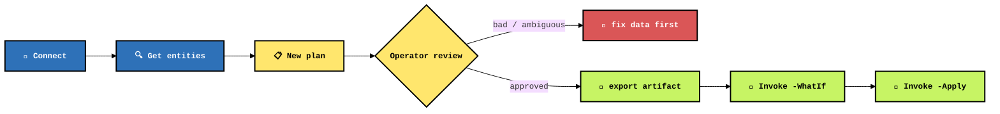

# LISSTech.EntitySync

**Vendor entity synchronization that refuses to guess silently: connect NetSuite and HaloPSA, build an explainable match plan, review every risky row, then apply only the changes you explicitly approve.**

[](https://learn.microsoft.com/powershell/)
[](https://dotnet.microsoft.com/)
[](https://www.netsuite.com/)
[](https://halopsa.com/)
[](#-safety-model)

[**Quick Start**](#-quick-start) · [**Architecture**](#%EF%B8%8F-architecture) · [**PowerShell API**](#-powershell-api) · [**Matching**](#-matching-rules) · [**Safety**](#-safety-model) · [**Build**](#-build--test)

---

## 📑 Table Of Contents

- [⚡ Quick Start](#-quick-start)
- [🏗️ Architecture](#%EF%B8%8F-architecture)
- [🎮 PowerShell API](#-powershell-api)
- [🧠 Matching Rules](#-matching-rules)
- [🔐 Configuration](#-configuration)
- [🧨 Safety Model](#-safety-model)
- [🔨 Build & Test](#-build--test)
- [📁 Project Structure](#-project-structure)

---

## ⚡ Quick Start

```powershell
# Build the binary module into .\Module\
just build

# Load the module
Import-Module .\Module\LISSTech.EntitySync.psd1 -Force

# Register vendor adapters. Parameters can also come from environment variables.
Connect-EntitySyncVendor -Vendor NetSuite
Connect-EntitySyncVendor -Vendor HaloPSA

# Plan NetSuite Customer -> HaloPSA Client sync. No writes happen here.
$plan = New-EntitySyncPlan `
  -SourceVendor NetSuite -SourceEntityType Customer `
  -TargetVendor HaloPSA -TargetEntityType Client `
  -CreateMissing

# Review the blast radius like an adult.
$plan.Items |
  Sort-Object Action, Score -Descending |
  Format-Table Action, Score, MatchType, @{n='Source';e={$_.Source.Name}}, @{n='Target';e={$_.Target.Name}}

# Save the plan artifact for ticket notes, peer review, or rollback breadcrumbs.
$plan | Export-EntitySyncPlan .\netsuite-halo-client-plan.json

# Dry-run the approved plan. Remove -WhatIf only when the plan is clean.
$plan | Invoke-EntitySyncPlan -Apply -WhatIf
```

---

## 🏗️ Architecture

```mermaid
%%{init: {'theme': 'base', 'themeVariables': {'fontFamily': 'monospace', 'fontSize': '13px', 'primaryColor': '#2E71B8', 'primaryBorderColor': '#000', 'primaryTextColor': '#000', 'lineColor': '#000'}}}%%
graph LR
    A["🎮 PowerShell Cmdlets<br/>binary module"] --> B["🔌 ConnectionRegistry<br/>active adapters"]
    B --> C["🟦 NetSuite Adapter<br/>customers"]
    B --> D["🟩 HaloPSA Adapter<br/>clients"]
    C --> E["📦 ExternalEntity<br/>canonical model"]
    D --> E
    E --> F["🧠 WeightedEntityMatcher<br/>explainable scoring"]
    F --> G["📋 EntitySyncPlan<br/>None / Link / Create / Review"]
    G --> H{"🧨 Invoke-EntitySyncPlan<br/>-Apply required"}
    H -->|"WhatIf / Review"| I["🛑 no vendor writes"]
    H -->|"approved actions"| J["✍️ adapter writes"]

    classDef blue fill:#2E71B8,stroke:#000,stroke-width:3px,color:#fff,font-weight:bold
    classDef mint fill:#4ECDC4,stroke:#000,stroke-width:3px,color:#000,font-weight:bold
    classDef amber fill:#FFE66D,stroke:#000,stroke-width:3px,color:#000,font-weight:bold
    classDef red fill:#DA5657,stroke:#000,stroke-width:3px,color:#fff,font-weight:bold
    classDef green fill:#C7F464,stroke:#000,stroke-width:3px,color:#000,font-weight:bold

    class A,B blue
    class C,D mint
    class E,F amber
    class G,H red
    class I,J green
```



| Layer | Role | Brutal truth |
|---|---|---|
| 🎮 **Cmdlets** | Operator surface | PowerShell objects in, PowerShell objects out. No GUI ceremony. |
| 🔌 **Adapters** | Vendor IO | NetSuite and HaloPSA specifics live at the edge, not smeared through sync logic. |
| 📦 **Canonical model** | Shared entity shape | Matching works against normalized `ExternalEntity` data instead of vendor-shaped chaos. |
| 🧠 **Matcher** | Decision support | Scores come with reasons. If it cannot explain the match, it does not pretend. |
| 📋 **Plan** | Change manifest | Sync becomes a reviewable artifact before it becomes vendor mutation. |
| 🧨 **Apply** | Controlled write path | `-Apply` is mandatory, `-WhatIf` is supported, `Review` rows are skipped. |

---

## 🎮 PowerShell API

| Cmdlet | Role |
|---|---|
| `Connect-EntitySyncVendor` | Configure and register a NetSuite or HaloPSA adapter. |
| `Get-EntitySyncConnection` | Inspect registered vendor connections. |
| `Test-EntitySyncConnection` | Validate adapter connectivity. |
| `Get-EntitySyncEntity` | Pull canonical entities from a connected vendor; `-Type` autocompletes supported entity types. |
| `New-EntitySyncPlan` | Compare source entities to target entities and emit a plan. |
| `Export-EntitySyncPlan` | Persist a plan to JSON. |
| `Import-EntitySyncPlan` | Reload a previously reviewed plan. |
| `Invoke-EntitySyncPlan` | Apply approved `Link` / `Create` items with PowerShell safety semantics. |

### Flow



---

## 🧠 Matching Rules

`New-EntitySyncPlan` uses weighted matching instead of magical thinking.

| Signal | Why it matters |
|---|---|
| Existing external ID | Strongest signal. If a target is already linked, do not rematch by vibes. |
| Normalized name | Handles punctuation, casing, leading `The`, and legal suffix terms derived from [`cleanco`](https://github.com/psolin/cleanco)'s organization type database. |
| Address details | Helps separate same-name entities and messy subsidiaries. |
| Score thresholds | `-AutoLinkScore` defaults to `90`; `-ReviewScore` defaults to `70`. |
| Reasons | Plan items explain which evidence pushed the score up or down. |

Plan actions are intentionally boring:

| Action | Meaning |
|---|---|
| `None` | Already linked or no write required. |
| `Link` | Confident match; write the source external ID to the target. |
| `Create` | No credible target found and `-CreateMissing` was requested. |
| `Review` | Too risky. Human eyes required. The apply path skips it. |

---

## 🔐 Configuration

Pass credentials as parameters or environment variables. Secrets are used to connect; secrets are not written to plan files.

### HaloPSA

| Variable | Parameter |
|---|---|
| `HALO_BASE_URL` | `-HaloBaseUrl` |
| `HALO_CLIENT_ID` | `-HaloClientId` |
| `HALO_CLIENT_SECRET` | `-HaloClientSecret` |

The module requests a bearer token from `auth/token` using HaloPSA client credentials. `-HaloScope` defaults to `all`.

Optional Halo controls: `-HaloTopLevelId`, `-HaloDefaultColour`, `-HaloNetSuiteCustomerIdField`.

### NetSuite

| Variable | Parameter |
|---|---|
| `NETSUITE_RESTLET_URL` | `-NetSuiteRestletUrl` |
| `NETSUITE_ACCOUNT_ID` | `-NetSuiteAccountId` |
| `NETSUITE_CONSUMER_KEY` | `-NetSuiteConsumerKey` |
| `NETSUITE_CONSUMER_SECRET` | `-NetSuiteConsumerSecret` |
| `NETSUITE_TOKEN_ID` | `-NetSuiteTokenId` |
| `NETSUITE_TOKEN_SECRET` | `-NetSuiteTokenSecret` |

---

## 🧨 Safety Model

This module is built for vendor data, which means mistakes are expensive and embarrassing.

- 🔒 Discovery does not write.
- 📋 Planning does not write.
- 🧪 `Invoke-EntitySyncPlan` supports `-WhatIf`.
- 🧨 `Invoke-EntitySyncPlan` requires `-Apply` before writes are allowed.
- 🛑 `Review` items are skipped during apply.
- 💾 Plans can be exported and reviewed before mutation.
- 🧼 Credentials stay out of exported plans.

The intended workflow is **inspect → plan → review → dry run → apply**. Anything else is cowboy nonsense.

---

## 🔨 Build & Test

Requires [PowerShell 7.4+](https://learn.microsoft.com/powershell/), [.NET 8 SDK](https://dotnet.microsoft.com/download), [just](https://github.com/casey/just), and [Pester](https://pester.dev/) for tests.

```powershell
just              # list recipes
just build        # compile src/LISSTech.EntitySync.csproj into Module/
just test-load    # import the module and list exported commands
just test         # run Pester tests
just clean        # remove compiled output
```

---

## 📁 Project Structure

```text
📦 LISSTech.EntitySync
├── 📜 Module/
│   └── LISSTech.EntitySync.psd1        # module manifest; compiled DLL lands here
├── 📚 docs/                            # external help markdown
├── 🌎 en-US/                           # about topic source
├── 🧪 Tests/                           # Pester tests
├── 🧬 src/
│   ├── Adapters/                       # HaloPSA + NetSuite vendor IO
│   ├── Commands/                       # public PowerShell cmdlets
│   ├── Core/                           # canonical models + plan types
│   ├── Mapping/                        # vendor-to-canonical mapping
│   ├── Matching/                       # weighted explainable matching
│   ├── Ports/                          # adapter abstractions
│   └── Runtime/                        # connection registry/runtime state
├── justfile                            # build/test automation
└── README.md
```

---

## 🧾 Status

Initial target: **NetSuite customers → HaloPSA clients**.

The core is intentionally vendor-neutral. Add the next vendor by implementing the adapter port, mapping into `ExternalEntity`, and leaving matching/planning alone.
