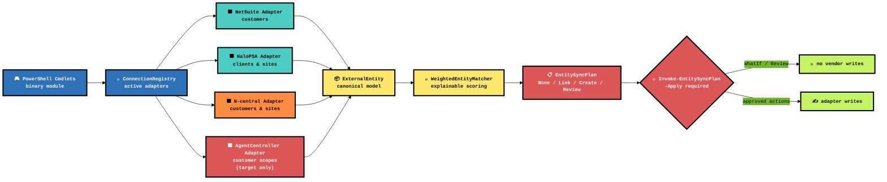
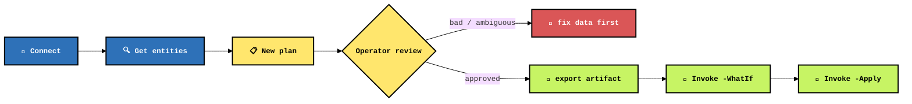

# LISSTech.EntitySync

**Vendor entity synchronization that refuses to guess silently: connect NetSuite, HaloPSA, N-central, and AgentController, build an explainable match plan, review every risky row, then apply only the changes you explicitly approve.**

[](https://learn.microsoft.com/powershell/)
[](https://dotnet.microsoft.com/)
[](https://www.netsuite.com/)
[](https://halopsa.com/)
[](https://www.n-able.com/products/n-central)
[](#-configuration)
[](#-safety-model)

[**Quick Start**](#-quick-start) · [**Architecture**](#%EF%B8%8F-architecture) · [**PowerShell API**](#-powershell-api) · [**Matching**](#-matching-rules) · [**Safety**](#-safety-model) · [**Build**](#-build--test)

---

## 📑 Table Of Contents

- [⚡ Quick Start](#-quick-start)
- [🏗️ Architecture](#%EF%B8%8F-architecture)
- [🎮 PowerShell API](#-powershell-api)
- [🧠 Matching Rules](#-matching-rules)
- [🔐 Configuration](#-configuration)
- [🧨 Safety Model](#-safety-model)
- [🔨 Build & Test](#-build--test)
- [📁 Project Structure](#-project-structure)

---

## ⚡ Quick Start

```powershell
# Build the binary module into .\Module\
just build

# Load the module
Import-Module .\Module\LISSTech.EntitySync.psd1 -Force

# Register vendor adapters. Parameters can also come from environment variables.
Connect-EntitySyncVendor -Vendor NetSuite
Connect-EntitySyncVendor -Vendor HaloPSA

# Plan NetSuite Customer -> HaloPSA Client sync. No writes happen here.
$plan = New-EntitySyncPlan `
  -SourceVendor NetSuite -SourceEntityType Customer `
  -TargetVendor HaloPSA -TargetEntityType Client `
  -CreateMissing

# Export an Excel review workbook. Use the Decision dropdown per row.
$plan | Export-EntitySyncPlan -Path .\netsuite-halo-client-plan.xlsx

# Or export into a directory and let the module generate the file name.
$reviewWorkbook = $plan | Export-EntitySyncPlan -Path $HOME\Downloads -PassThru

# Reload the reviewed workbook back into an executable plan.
$plan = Import-EntitySyncPlan .\netsuite-halo-client-plan.xlsx

# Dry-run the approved plan. Remove -WhatIf only when the plan is clean.
$plan | Invoke-EntitySyncPlan -Apply -WhatIf
```

### N-central to AgentController customer scopes

AgentController sync is target-only and uses one complete `CustomerScope` plan containing both N-central
Customer and Site records. Use `-WhatIf` for the first run; it reports the authoritative batch without
changing AgentController.

```powershell
Import-Module .\Module\LISSTech.EntitySync.psd1 -Force

Connect-EntitySyncVendor -Vendor NCentral
# Reuse the operator session JWT minted by Connect-DeviceAssetOps:
#   $ltacToken = Get-DeviceAssetOpsAccessToken
#   Connect-DeviceAssetOps -AuthUri 'https://api-agent-controller.clfy-b.lissonline.com'
$agentControllerSession = Get-DeviceAssetOpsAccessToken -AsSession
Connect-EntitySyncVendor -Vendor AgentController -Session $agentControllerSession

$customerPlan = New-EntitySyncPlan `
  -SourceVendor NCentral -SourceEntityType CustomerScope `
  -TargetVendor AgentController -TargetEntityType Customer `
  -CreateMissing

$customerPlan | Export-EntitySyncPlan -Path .\ncentral-ltac-customers.xlsx
$customerPlan = Import-EntitySyncPlan .\ncentral-ltac-customers.xlsx

$customerPlan | Invoke-EntitySyncPlan -Apply -WhatIf -PassThru
```

The plan reads both entity types from N-central. Each site-derived scope carries its parent N-central customer
identifier. A missing parent, unsafe or duplicate identifier, `Review`, `Reject`, `No Update`, or `None` row
blocks the entire apply so omission cannot retire an existing AgentController scope.

When the reviewed plan and dry-run output are clean, remove `-WhatIf` to apply the approved rows as
one authoritative AgentController batch:

```powershell
$customerPlan | Invoke-EntitySyncPlan -Apply -PassThru
```

---

## 🏗️ Architecture



| Layer | Role | Brutal truth |
|---|---|---|
| 🎮 **Cmdlets** | Operator surface | PowerShell objects in, PowerShell objects out. No GUI ceremony. |
| 🔌 **Adapters** | Vendor IO | NetSuite, HaloPSA, N-central, and LTAC specifics live at the edge, not smeared through sync logic. |
| 📦 **Canonical model** | Shared entity shape | Matching works against normalized `ExternalEntity` data instead of vendor-shaped chaos. |
| 🧠 **Matcher** | Decision support | Scores come with reasons. If it cannot explain the match, it does not pretend. |
| 📋 **Plan** | Change manifest | Sync becomes an Excel-reviewable artifact before it becomes vendor mutation. |
| 🧨 **Apply** | Controlled write path | `-Apply` is mandatory and `-WhatIf` is supported. AgentController additionally requires a complete, fully approved snapshot. |

---

## 🎮 PowerShell API

| Cmdlet | Role |
|---|---|
| `Connect-EntitySyncVendor` | Configure and register a NetSuite, HaloPSA, N-central, or LTAC adapter; vendor-specific parameters appear after `-Vendor`. |
| `Get-EntitySyncConnection` | Inspect registered vendor connection objects. |
| `Test-EntitySyncConnection` | Validate adapter connectivity. |
| `Get-EntitySyncLookup` | Discover vendor lookup IDs such as HaloPSA top levels and N-central service organizations. |
| `Get-EntitySyncEntity` | Pull canonical entities from a connected vendor; `-Type` defaults to the selected vendor's supported entity type. |
| `Invoke-EntitySyncNetSuiteSuiteQL` | Run a SuiteQL query against the active NetSuite connection and emit rows as PSObjects. |
| `New-EntitySyncPlan` | Compare source entities to target entities and emit a plan. |
| `Export-EntitySyncPlan` | Persist a plan to a reviewer-friendly `.xlsx` workbook or fallback JSON. |
| `Import-EntitySyncPlan` | Reload a reviewed `.xlsx` workbook or JSON plan. |
| `Invoke-EntitySyncPlan` | Apply approved `Link` / `Create` items with PowerShell safety semantics. |
| `Invoke-EntitySyncChain` | Generate or apply reviewed workbooks for NetSuite -> HaloPSA -> downstream vendor chains. |
| `Set-EntitySyncCustomProperty` | Plan or apply a custom-property write on an N-central customer. |

### Flow



### Excel Review

`Export-EntitySyncPlan` writes `.xlsx` files when the path ends in `.xlsx`. The visible `Review` worksheet is the operator surface; hidden workbook sheets preserve the full plan for safe round-trip import.

`-Path` accepts either a full file path or an existing directory. When it is a directory, the module generates a timestamped workbook name like `EntitySync-NetSuite-Customer-to-HaloPSA-Client-20260625-115250.xlsx`. `-FilePath` is an alias for users who prefer explicit file-path naming. Use `-PassThru` to return the created `FileInfo`.

Reviewers choose one `Decision` per row:

| Decision | Result on import |
|---|---|
| `Accept Planned` | Keeps the generated action and marks the item accepted. |
| `Reject` | Changes the item to `None`; apply skips it. |
| `Create` | Forces a target create. |
| `Link` | Forces a link/update of the target external/custom field. |
| `Update` | Forces an update of the matched target. |
| `No Update` | Changes the item to `None`; apply skips it without treating it as a rejection. |
| `Review` | Keeps the item blocked from apply. |

If the source was matched to the wrong target, choose the correct existing target from the `TargetName` dropdown. If `Decision` is blank or `Review`, importing the workbook changes that row to `Link`, assigns the selected target, marks the match as `ReviewerOverride`, and records a reviewer reason. A changed `TargetName` cannot be combined with `Create`, `Reject`, or `No Update`. If multiple targets have the same name, import fails with an ambiguity error rather than guessing.

`ReviewerNotes` are appended to the item's reasons during import, so the operator's decision context follows the plan into `-WhatIf` and apply output.

When HaloPSA is the target, `New-EntitySyncPlan` reads full client records by default so custom fields such as `CFNetSuiteCustomerID` are available for link detection. Use `-FullTargetObjects` only when you need HaloPSA site detail enrichment for address/postal matching; it adds another API call per client with a site.

Use `-ThrottleLimit` to cap parallel work. `0` means automatic/default. `-ThrottleLimit 1` forces sequential source/target reads, sequential matching, and one-at-a-time Halo full-object enrichment.

For faster HaloPSA planning, the adapter attempts to derive the numeric Halo custom field ID from `-HaloNetSuiteCustomerIdField`, then requests it from list reads with `include_custom_fields=<id>`.

You can still provide the field ID explicitly as an override:

```powershell
Connect-EntitySyncVendor -Vendor HaloPSA -HaloNetSuiteCustomerIdField CFNetSuiteCustomerID -HaloNetSuiteCustomerIdFieldId 123
```

If derivation fails and no explicit ID is configured, planning safely falls back to full client reads so link detection still sees `CFNetSuiteCustomerID`.

---

## 🧠 Matching Rules

`New-EntitySyncPlan` uses weighted matching instead of magical thinking.

| Signal | Why it matters |
|---|---|
| Existing external ID | Strongest signal. If a target is already linked, do not rematch by vibes. |
| Normalized name | Handles punctuation, casing, leading `The`, and legal suffix terms derived from [`cleanco`](https://github.com/psolin/cleanco)'s organization type database. |
| Address details | Helps separate same-name entities and messy subsidiaries. |
| Score thresholds | `-AutoLinkScore` defaults to `90`; `-ReviewScore` defaults to `70`. |
| Reasons | Plan items explain which evidence pushed the score up or down. |

Plan actions are intentionally boring:

| Action | Meaning |
|---|---|
| `None` | Already linked or no write required. |
| `Link` | Confident match; write the source external ID to the target. |
| `Create` | No credible target found and `-CreateMissing` was requested. |
| `Review` | Too risky. Human eyes required. The apply path skips it. |

---

## 🔐 Configuration

Pass credentials as parameters or environment variables. Secrets are used to connect; secrets are not written to plan files.

### HaloPSA

| Variable | Parameter |
|---|---|
| `HALO_BASE_URL` | `-HaloBaseUrl` |
| `HALO_CLIENT_ID` | `-HaloClientId` |
| `HALO_CLIENT_SECRET` | `-HaloClientSecret` |
| `HALO_NCENTRAL_INTEGRATION_ID` | `-HaloNCentralIntegrationId` |

The module requests a bearer token using HaloPSA client credentials. It tries `auth/token` first and falls back to `token`, matching Halo's client-credentials Postman collection. `-HaloScope` defaults to `all`.

Optional Halo controls: `-HaloTopLevelId`, `-HaloDefaultColour`, `-HaloNetSuiteCustomerIdField`, `-HaloNCentralIntegrationId`.

Halo client retrieval automatically pages through `api/client` with `pageinate`, `page_size`, and `page_no`. If the count is lower than the Halo UI, check `-IncludeInactive` and `-HaloTopLevelId`; both affect which clients are returned.

`Get-EntitySyncEntity` is fast by default and returns the Halo list payload. Use `-FullObjects` only when you need per-client detail/site address enrichment; that mode is intentionally slower and shows standard PowerShell progress.

Discover top-level IDs with:

```powershell
Get-EntitySyncLookup -Vendor HaloPSA -Type TopLevel
Get-EntitySyncLookup -Vendor HaloPSA -Type NCentralIntegration
Get-EntitySyncLookup -Vendor HaloPSA -Type NCentralIntegrationLink
Get-EntitySyncLookup -Vendor NCentral -Type ServiceOrganization
```

For `New-EntitySyncPlan -SourceVendor HaloPSA -TargetVendor NCentral`, HaloPSA's N-central integration client links are used as authoritative Halo client to N-central customer matches. If no Halo link exists, an N-central customer `externalId` equal to the HaloPSA client ID is treated as this workflow's owned link marker. First-class HaloPSA Site -> NCentral Site plans use HaloPSA `site_links` as authoritative site matches and parent client links to decide where missing N-central sites should be created.

Applying HaloPSA -> NCentral client plans maintains both sides of the client relationship. N-central creates use confirmed OpenAPI (`POST /api/service-orgs/{soId}/customers`), updates use EI2 SOAP `customerModify`, customer names sanitize `&` to `and`, and the adapter writes `externalId = <HaloPSA client ID>` plus organization custom properties for `HaloPSA Client ID`, `NetSuite Customer ID`, and `NetSuite Customer Name`. After a successful N-central write, HaloPSA `client_links` are upserted with `POST /api/ncentraldetails`. Site plans create N-central sites with `POST /api/customers/{customerId}/sites` and upsert HaloPSA `site_links`; N-central site field updates are no-op until a confirmed N-central site update endpoint is available.

### NetSuite

| Variable | Parameter |
|---|---|
| `NETSUITE_ACCOUNT_ID` | `-NetSuiteAccountId` |
| `NETSUITE_CONSUMER_KEY` | `-NetSuiteConsumerKey` |
| `NETSUITE_CONSUMER_SECRET` | `-NetSuiteConsumerSecret` |
| `NETSUITE_TOKEN_ID` | `-NetSuiteTokenId` |
| `NETSUITE_TOKEN_SECRET` | `-NetSuiteTokenSecret` |

NetSuite customer discovery uses standard REST Web Services SuiteQL, not a RESTlet. `NETSUITE_ACCOUNT_ID` should be the account ID only, for example:

```text
1234567
1234567_SB1
```

The adapter derives `https://<account>.suitetalk.api.netsuite.com/services/rest/query/v1/suiteql` from that account ID. The NetSuite role used by the token must have REST Web Services access and permissions to query customers with SuiteQL.

### N-central

| Variable | Parameter |
|---|---|
| `NCENTRAL_BASE_URL` | `-NCentralBaseUrl` |
| `NCENTRAL_USER_API_TOKEN` | `-NCentralUserApiToken` |
| `NCENTRAL_SERVICE_ORG_ID` | `-NCentralServiceOrgId` |
| `NCENTRAL_SOAP_USERNAME` | `-NCentralSoapUsername` |
| `NCENTRAL_SOAP_PASSWORD` | `-NCentralSoapPassword` |
| `NCENTRAL_SOAP_ENDPOINT_PATH` | `-NCentralSoapEndpointPath` |
| `NCENTRAL_SOAP_NAMESPACE` | `-NCentralSoapNamespace` |
| `NCENTRAL_HALOPSA_ID_PROPERTY_LABEL` | `-NCentralHaloPsaIdPropertyLabel` |
| `NCENTRAL_NETSUITE_ID_PROPERTY_LABEL` | `-NCentralNetSuiteIdPropertyLabel` |
| `NCENTRAL_NETSUITE_NAME_PROPERTY_LABEL` | `-NCentralNetSuiteNamePropertyLabel` |

N-central customer discovery and creation use the REST API. The adapter exchanges the User-API token at `/api/auth/authenticate`, reads customers from `/api/customers`, and creates customers with `/api/service-orgs/{soId}/customers`. For LISSTech N-central, pass `-NCentralServiceOrgId 50` or set `NCENTRAL_SERVICE_ORG_ID=50` before creating customers.

N-central customer updates and organization custom-property writes use EI2 SOAP at `dms2/services2/ServerEI2` by default. The custom property labels default to `HaloPSA Client ID`, `NetSuite Customer ID`, and `NetSuite Customer Name`; configure the labels if N-central uses different names.

You can set an existing N-central customer organization custom property directly when needed:

```powershell
Set-EntitySyncCustomProperty -Vendor NCentral -CustomerId 390 -Name 'HaloPSA Client ID' -Value 684 -Apply -WhatIf
```

This command updates existing custom-property values only; create the custom-property definitions in N-central first.

### AgentController

| Variable | Parameter |
|---|---|
| `LTAC_BASE_URL` | `-Url` |
| `LTAC_BEARER_TOKEN` | `-Token` |
| _DeviceAssetOps session_ | `-Session` (`OpsBaseUrl` plus SecureString token) |
| _operator session JWT_ | `-SecureToken` (`SecureString`, manual mode) |

`Connect-EntitySyncVendor -Vendor AgentController -Session $session` (`LTAC` is also accepted and normalizes to `AgentController`) registers a target-only adapter for syncing one complete N-central Customer-plus-Site snapshot into AgentController customer scopes. Build that snapshot with `-SourceEntityType CustomerScope`; separate Customer or Site plans cannot be applied because the AgentController RPC retires N-central scopes absent from its authoritative payload. The session should come from `LISSTech.DeviceAssetOps` after authenticating through the AgentController API/auth base URL (`https://api-agent-controller.clfy-b.lissonline.com`); it carries the declared ops/PostgREST base URL (`https://ops-agent-controller.clfy-b.lissonline.com`) and a SecureString JWT. AgentController has no customer-scope read endpoint, so plans never return target candidates. Site-derived scopes carry their parent N-central customer's identifier as `ncentral_parent_customer_id`. `Token` never appears in the returned connection object. See `specs/001-ltac-sync-adapter/spec.md`.

AgentController apply calls exactly `POST /rpc/sync_ncentral_customers`; connection validation calls the non-mutating `POST /rpc/has_scope`. Both are generated from the pinned typed OpenAPI contract and relative to the ops/PostgREST base URL. EntitySync does not call `/rest/rpc/...`, derive `ops-` from `api-`, or try alternate paths after 404. For manual `-Url`/`LTAC_BASE_URL`, use the ops endpoint, not the API/auth host.

`-SecureToken` accepts a `SecureString` for manual mode. Prefer `-Session` for normal cross-module use because it carries endpoint metadata and the SecureString token together. The SecureString is unwrapped in-process and used only for the AgentController authorization header. `-Session`, `-Token`, and `-SecureToken` are separate parameter sets; pass exactly one.

AgentController credentials are treated as connection-only secrets. `Test-EntitySyncConnection` calls the generated `has_scope` client operation and succeeds only when the token grants `operator_access:write` or administrator access. The bearer token is omitted from connection output, plans, results, and adapter errors. AgentController apply sends one generated-client request only when every row in the complete `CustomerScope` snapshot is approved and valid; otherwise the entire batch is blocked before HTTP.

---

## 🧨 Safety Model

This module is built for vendor data, which means mistakes are expensive and embarrassing.

- 🔒 Discovery does not write.
- 📋 Planning does not write.
- 🧪 `Invoke-EntitySyncPlan` supports `-WhatIf`.
- 🧨 `Invoke-EntitySyncPlan` requires `-Apply` before writes are allowed.
- 🛑 Generic plans skip `Review` items; AgentController blocks the complete authoritative batch instead.
- 💾 Plans can be exported and reviewed before mutation.
- 🧼 Credentials stay out of exported plans.
- 🔐 AgentController bearer tokens and unrelated N-central registration tokens are not copied into AgentController batch requests or result messages.

The intended workflow is **inspect → plan → review → dry run → apply**. Anything else is cowboy nonsense.

---

## 🔨 Build & Test

Requires [PowerShell 7.4+](https://learn.microsoft.com/powershell/), [.NET 8 SDK](https://dotnet.microsoft.com/download), [just](https://github.com/casey/just), and [Pester](https://pester.dev/) for tests.

```powershell
just              # list recipes
just build        # compile src/LISSTech.EntitySync.csproj into Module/
just test-load    # import the module and list exported commands
just test         # run Pester tests
just generate-agentcontroller-client # regenerate the pinned NSwag client
just check-agentcontroller-client    # fail if checked-in generated code is stale
just clean        # remove compiled output
```

---

## 📁 Project Structure

```text
📦 LISSTech.EntitySync
├── 📜 Module/
│   └── LISSTech.EntitySync.psd1        # module manifest; compiled DLL lands here
├── 📚 docs/                            # external help markdown
├── 🌎 en-US/                           # about topic source
├── 🧪 Tests/                           # Pester tests
├── 🧬 src/
│   ├── Adapters/                       # HaloPSA + NetSuite + N-central + AgentController vendor IO
│   ├── Commands/                       # public PowerShell cmdlets
│   ├── Core/                           # canonical models + plan types
│   ├── Mapping/                        # vendor-to-canonical mapping
│   ├── Matching/                       # weighted explainable matching
│   ├── Ports/                          # adapter abstractions
│   └── Runtime/                        # connection registry/runtime state
├── justfile                            # build/test automation
└── README.md
```

---

## 🧾 Status

Shipped adapters:

- **NetSuite → HaloPSA**: NetSuite customers sync into HaloPSA clients (initial sync flow).
- **HaloPSA → N-central**: HaloPSA clients and sites sync into N-central customers and sites, maintaining both sides of the client relationship via `externalId` and `client_links`/`site_links`.
- **N-central → AgentController**: N-central customers and sites sync into AgentController customer scopes, applied as one authoritative batch per approved plan (see `specs/001-ltac-sync-adapter/`).

NetSuite is a source-only adapter; AgentController is a sync target only. HaloPSA and N-central participate as both source and target.

The core is intentionally vendor-neutral. Add the next vendor by implementing the adapter port, mapping into `ExternalEntity`, and leaving matching/planning alone.
